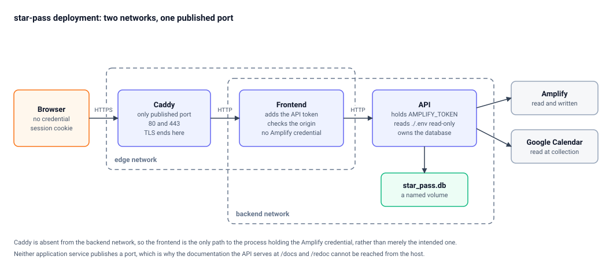
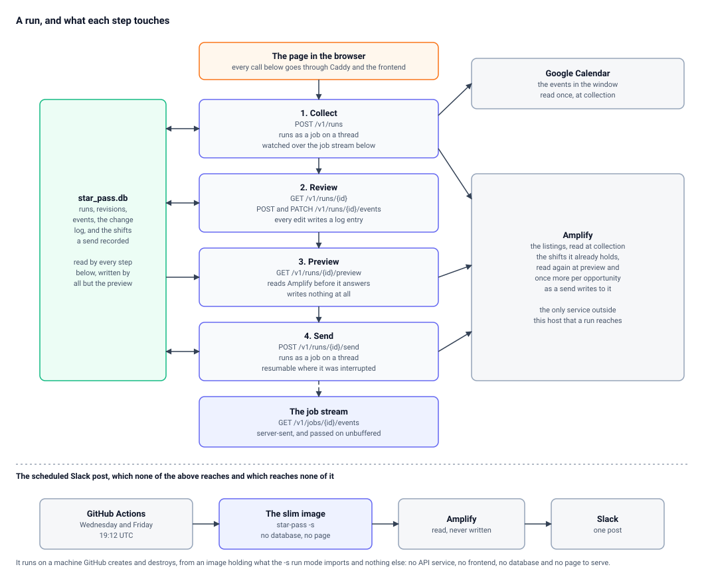

# Architecture

Two pictures of the same application: what the deployment is made of,
and what a run does across it. Between them they show the shape the
security argument rests on, which is otherwise spread across
`compose.yaml`, `deploy/caddy/Caddyfile` and half a dozen decisions.

Both are generated. Edit the boxes, the networks and the arrows in
`scripts/generate_architecture.py`, then:

```bash
python scripts/generate_architecture.py
```

Commit the SVG files it writes. `tests/test_architecture.py` fails
while a committed picture disagrees with the generator, so a forgotten
run is caught rather than shipped.

## The deployment



Four things in that picture do the work:

- **Caddy is the only service publishing a port.** Both application
  services are unreachable from the host, which is why the
  documentation the API serves at `/docs` and `/redoc` cannot be
  opened from outside a deployment.
- **There are two networks, and Caddy is absent from the second.** The
  frontend is the only box on both. So the path to the process holding
  the Amplify credential runs through the process that checks a write
  came from its own page, and through nothing else - a boundary rather
  than an intention (D5, D17).
- **One process holds the credential, and it is not the one facing the
  browser.** `AMPLIFY_TOKEN` reaches the API from a file mounted
  read-only on that service alone, so an internet-facing process never
  has the secret on its filesystem (D9, D17). The frontend is handed
  two values by name, neither of them an Amplify credential.
- **The database is attached to the API as well.** The state that
  outlives a container has the same single owner as the credential.

TLS ends at Caddy, which serves the site with its internal certificate
authority by default (D14). What passes between containers is plain
HTTP on networks nothing else is on.

## What a run does



The four steps happen in that order, and each is a request the page
makes through Caddy and the frontend. What separates them is what they
reach for:

- **Collecting** reads a window of a Google Calendar and the Amplify
  listings the matched categories name, and writes a revision.
- **Reviewing** reads and writes the database only. Every edit adds an
  entry to the log of what was done.
- **Previewing** reads Amplify before it answers, so what it reports
  as already there is what is there now, and writes nothing at all.
- **Sending** writes to Amplify one opportunity at a time, reading
  each immediately before writing to it, and records a batch only once
  its request succeeded.

**Collecting and sending run as jobs on a thread**, which is why they
are the two steps with a stream to watch: the page follows
`GET /v1/jobs/{id}/events` rather than waiting on a request. A send
interrupted part way through is resumed from where it stopped (D10).

The scheduled Slack post is drawn below the rule because it shares
nothing with any of it: a different machine, a different image, no
database and no page. It reads Amplify and posts, twice a week.

## Reading the pictures

- **Orange** is somebody at a browser. **Indigo** is a process this
  repository ships. **Green** is state that outlives a container.
  **Grey** is a service belonging to somebody else.
- A **dashed rectangle** is a network, named in its bottom left
  corner.
- A **solid arrow** is a request. A **dashed arrow** is something
  watched over time rather than asked for once.
- A **double-headed arrow** is read and written.

## Where the facts come from

The pictures are drawn from these, and disagree with none of them:

- `compose.yaml` - the services, the two networks, the credential
  mount and the volume.
- `deploy/caddy/Caddyfile` - the published port, where TLS ends, and
  the Content Security Policy.
- `docs/design/decisions.md` - D5, D9, D10, D14 and D17 in
  particular.
- `docs/api/openapi.json` - the paths named in the second picture.
